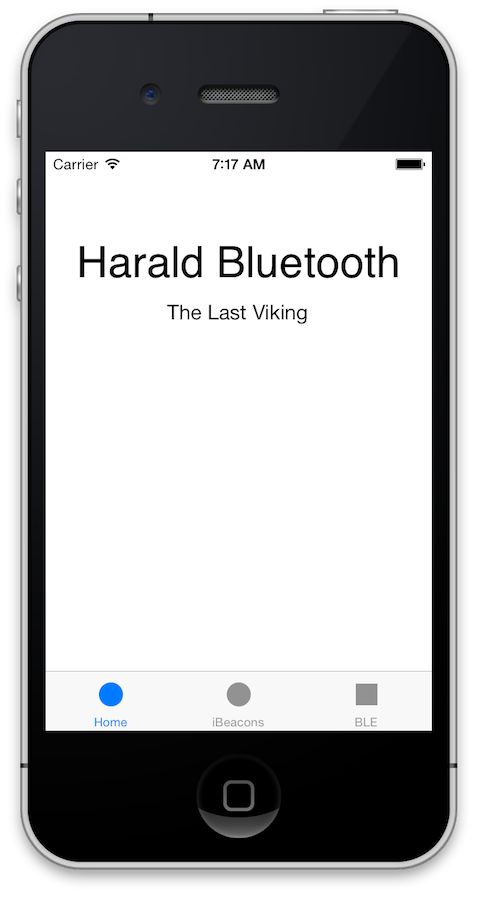
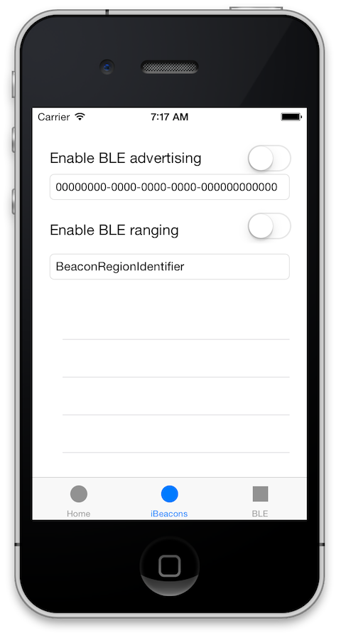

UNSTABLE - WORK IN PROGRESS

Tracking mobile iBeacons and BlueTooth Low Energy engagements with Node.js
--

###iBeacons are Apples convention for handling Bluetooth Low Energy engagements

iBeacons are Bluetooth Low Energy(BLE) wireless sensors that support a specific [HID profile schema ](https://developer.bluetooth.org/TechnologyOverview/Pages/HID.aspx) instead of the traditional [GATT profile ](http://en.wikipedia.org/wiki/Bluetooth_profile#Attribute_Profile_.28ATT.29).  Additionally Apple iBeacons provide convention, libraries and integration into mobile location services.  iBeacons breaks down BLE into 3 core features: broadcast, monitoring and ranging.

Bluetooth Low Energy Energy Beacons have come into the world around us.  Apple's integration of Bluetooth technology into branded iBeacons will inevitable proliferate the technology.  Large implementations of the technology such as [ MLB's installation into ball parks ](http://techcrunch.com/2013/09/29/mlbs-ibeacon-experiment-may-signal-a-whole-new-ball-game-for-location-tracking/), and [PayPal's Beacon ](https://www.paypal.com/us/webapps/mpp/beacon ) payment system are making facilities and locations smart. Startups like [estimote](http://estimote.com) , [Brick Trends](http://bricktrends.com), [Pebble](http://pebble.com) are making it easier for developers and businesses to integrate the technology into their customers daily lives.  All this is making your mobile device 'the new endpoint' and mobile application's more of a digital proxy for users interacting in real world.

###GPS gives devices 'vicinity' awareness, BLE iBeacons gives devices 'proximity' awareness

Leveraging Bluetooth your mobile device can tell how far away your user is from a bluetooth 'beacon'.  GPS gave mobile devices the power of vicinity; your device knows where it is with a neighborhood block accuracy (provided you had line of sight to a GPS satellite).  This singular technology gave way to location targeted push notifications with geo fencing, time and location relevant mobile Ad's, geo caching games and of course everyone's favorite "Dude Where's my Car" mobile apps.

BlueTooth LE and iBeacons will extend these use cases by illuminate the regions of our lives in the shadow of GPS line of Sight.  In-store retail "brick" analytics (currently brick and mortar retailers have no idea where you are in their store or how your spending your time ) is likely to see the largest shift.

Retail kiosks, end-caps, and payment terminals are blind, dumb and mute to your mobile device.  Effectively **the urinal in the men's bathroom is smarter than your average retail kiosk; at least the urinal knew to flush when you stepped away**. iBeacons will make facilities, displays and the devices that power them aware of the mobile device ( and user ) in front of them.

### Location Aware devices are going to change Retail

With [70 percent of smartphone shoppers use a store locator to plan their shopping trip](http://www.nielsen.com/us/en/newswire/2013/a-mobile-shoppers-journey--from-the-couch-to-the-store--and-back.html).  Mobile apps will play an integral roll in store shopping experience.

Retail and real world 'brick and mortar' vendors know the power of Mobile applications, justified by stats such as [Forty-six percent of shoppers say they are less likely to comparison shop when using a mobile app](http://www.comscore.com/Insights/Presentations_and_Whitepapers/2013/Choices_Channels_and_Convenience_Enhancing_the_Online_Shopping_Experience)

Coupling purchases and the fact that [25 million Americans use Coupon apps each month](https://www.npd.com/wps/portal/npd/us/news/press-releases/pr_120523/) and the [prediction that the number of U.S. adult smartphone users who also use mobile coupons will jump to 40.8 million at the end of 2013](http://www.emarketer.com/Article/Digital-Coupons-Mobile-Give-Cheapskates-Staying-Power/1009847#Jy3uKPRgRE7lZiuJ.99) gives ecosystem opportunity around BLE and iBeacon technology.

Bluetooth enabled accessories are projected to experience massive growth—220 million units this year to nearly 1 billion per year by 2016 (ABI Research)

###Why does Node Matter
Bluetooth engagements can create analytic 'engagement' 100 packages every millisecond, and bursting this information to another mobile devices; possibly in the hands of retail associate. This information needs to be in the hands ( or devices ) of people that can engage with the potential customer in realtime.  Pairing in store realtime analytics with shopper loyalty programs gives retail floor associates opportunity to engage at the moment of interest.  Node apps can collect this information and trigger Push Notifications, email alerts and realtime at the time of opportunity.

Additionally dashboards can give daily and realtime analytics to floor managers on which associates are effectively engaging with their customers. 

Node.js realtime low latency response and request architecture makes it a perfect collector, and aggregator for this information.  Node can be deployed on the cloud or even in the facility on a device that is collecting this information. 

Combined with the variety of NPM modules available for displaying this data, delivering it cloud or storing it in databases or 3rd party analytics engines makes Node.js the perfect technology for the middle tier. Weather you are running the bluetooth sniffing Node application on site in a Raspberry Pi, a Laptop or as a cloud aggregator Node fits the need perfectly.

### How intro :

All Bluetooth Low Energy devices (including iBeacons) are identified via a UUID (Device Identifier).  Devices either operate as Central or  a Peripheral configuration.  The Mobile Application 'Herald' that goes along with this posting can operate as both a Central (connecting and interacting with Peripheral's in its proximity) and also as Peripheral allowing other Central's to discover and interact with it.

The users iPhone and Android device acts as an moving blueTooth 'endpoint' in which the dynamic BLE 'network' discovers and connects to the application.  Once the 'Herald' app on the users device connects and interacts with the beacon devices in the word; Herald will report back the interaction ( referred to as an engagement in this sample ) to the server.

Since we want to share and report these interactions platform then your going to need to store the data on the Server.  So I built a small node.js mobile servlet that catches the BLE Beacon engagement and stores the information for later analysis and review.

If you want to test it out the mobile application is preconfigured to use a staged instance of the server; of course you can also stand up your own supporting server by deploying the LoopBack Node.js Server on your Cloud Provider of choice or on your own machine.

### How mobile client : iBeacon iPhone Application

The [iBeacon iPhone Application](/client-iphone) is a simple native iOS application that allows configuration as a Central, a Peripheral or both. Once you download the github repo you can run the application from XCode in the simulator ( you will not be able to activate the BlueTooth features unless you have a secondary blueTooth device attached to your dev machine), or install on an iOS device connected to your host machine.

The initial splash screen will give you an idea where the app name came from.  The Second tab is where the magic happens.  you can enable your iPhone to to 'Advertise', making your phone look like a Peripheral to other Central devices in the vicinity.   Additionally you can enable 'BLE ranging' and your device will look for other iBeacons and report back the 'range' or proximity of the BLE Peripheral. The TextField below each of the switches shows the identification the device is advertising and ranging as.

#### iPhone iBeacon Demo App




You can find the source code on [github](http://github.com/mschmulen/tracking-bluetooth-ibeacons-with-node) and experiment with iBeacons and BLE devices yourself.

1. Start from simple Tab application

2. Add the iOS frameworkS
    	CoreBluetooth.framework
		CoreLocation.framework	
		
##### Generating your unique proximityUUID

To genette a unique proximityUUID open the terminal and run the ```uuidgen``` tool.

```
AF23CFD3-1F95-42B8-8F2C-FEAC039D6F92
```

you can update the harald application with your unique proximityUUID by modifying the kUUID string in iBeaconViewController.m

```
static NSString * const kUUID = @"AF23CFD3-1F95-42B8-8F2C-FEAC039D6F92";
```

major and minor

### Track you mobile BlueTooth engagements with a node.js servlet :

TBD 

### How hardware

If you have 2 iOS7 devices then you can explore the interaction.  Additionally if you have a BlueTooth embedded device such as the 
[Ti cc2540 & cc2541 sensor tag](http://www.ti.com/ww/en/wireless_connectivity/sensortag/index.shtml?DCMP=sensortag&HQS=sensortag-bn) then you can explore the use case as it would be for most real world use cases. Check out the [Ti SensorTag User Guide](http://processors.wiki.ti.com/index.php/SensorTag_User_Guide) for more information on the Ti sensor tag and kit.

** a quick note on debugging, ios7 will not allow you to debug via the simulator, so you will have debug through a connected iOS device **

Also check out some of these BLE device vendors that provide hardware beacon devices:

- [redbearlab] (http://redbearlab.com/ibeacon/)
- [kontakt.io](http://kontakt.io/)

### References 

---

Developer resources and reference documents

- [corebluetooth-doesnt-let-you-see-ibeacons](http://developer.radiusnetworks.com/2013/10/21/corebluetooth-doesnt-let-you-see-ibeacons.html)
- [Lost-and-Found Bluetooth Accessory 'Tile' Passes $1 Million in Pre-Orders](http://www.macrumors.com/2013/07/15/lost-and-found-bluetooth-accessory-tile-passes-1-million-in-pre-orders/)
- [Android iBeacon Library](http://developer.radiusnetworks.com/ibeacon/android/)
- [Bluetooth devices to gain notification support in iOS 7 & Mavericks with Apple's new APIs](http://appleinsider.com/articles/13/06/13/bluetooth-devices-to-gain-notification-support-in-ios-7-mavericks-with-apples-new-apis)
- [With iBeacon, Apple is going to dump on NFC and embrace the internet of things](http://gigaom.com/2013/09/10/with-ibeacon-apple-is-going-to-dump-on-nfc-and-embrace-the-internet-of-things/)
- [github.com/manishnath/iBeaconCenter](https://github.com/manishnath/iBeaconCenter)
- [How to Make an iBeacon Out of a Raspberry Pi](http://developer.radiusnetworks.com/2013/10/09/how-to-make-an-ibeacon-out-of-a-raspberry-pi.html)
- [http://stackoverflow.com/questions/16151360/use-bluez-stack-as-a-peripheral-advertiser/19039963#19039963](http://stackoverflow.com/questions/16151360/use-bluez-stack-as-a-peripheral-advertiser/19039963#19039963)
- [whats-new-in-bluetooth-le-ios-7](http://www.doubleencore.com/2013/09/whats-new-in-bluetooth-le-ios-7/)
- [few-ios-7-tidbits-you-probably-didn-t-hear-about](http://blog.greggant.com/post/62060213476/a-few-ios-7-tidbits-you-probably-didn-t-hear-about)
- [developer.apple.com/AboutCoreBluetooth/Introduction.html](https://developer.apple.com/library/ios/documentation/NetworkingInternetWeb/Conceptual/CoreBluetooth_concepts/AboutCoreBluetooth/Introduction.html#//apple_ref/doc/uid/TP40013257-CH1-SW1)
- [Getting started with Xcode 4.x and Bluetooth Smart (BLE) on iOS](http://web.stalliance.no/blelogg/?page_id=52)
- [BLE Tutorial 2](http://web.stalliance.no/blelogg/?page_id=180)
- [A look at the CBCentralManager class of iOS](http://web.stalliance.no/blelogg/?page_id=131)
- [iBeacons !](http://web.stalliance.no/blelogg/?p=269)
- [Ti Bluetooth SensorTag ](http://processors.wiki.ti.com/index.php/Bluetooth_SensorTag?DCMP=lprf-stdroid&HQS=lprf-stdroid-pr-wiki1)


