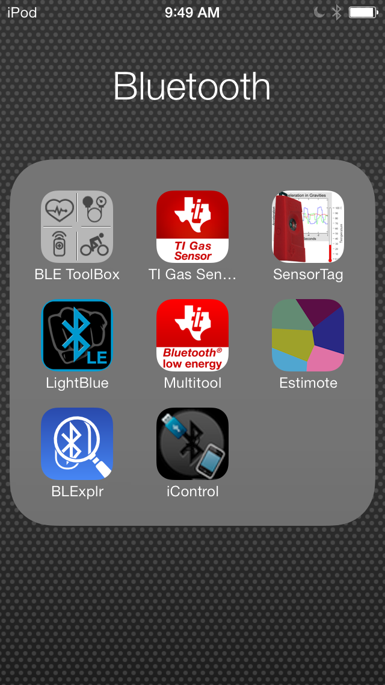
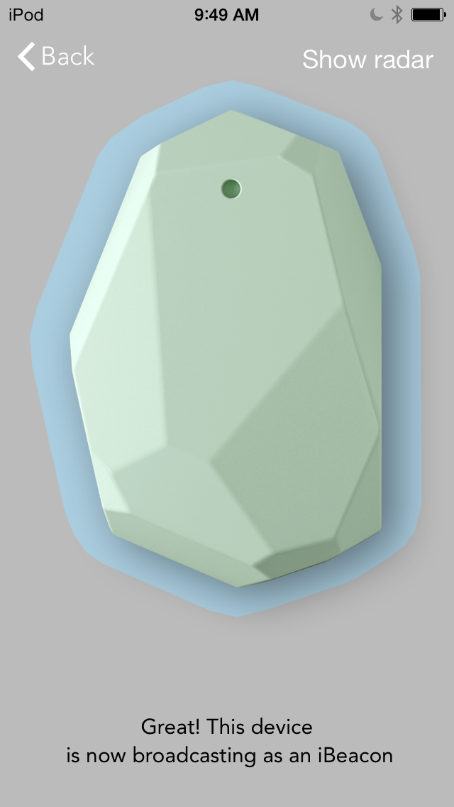
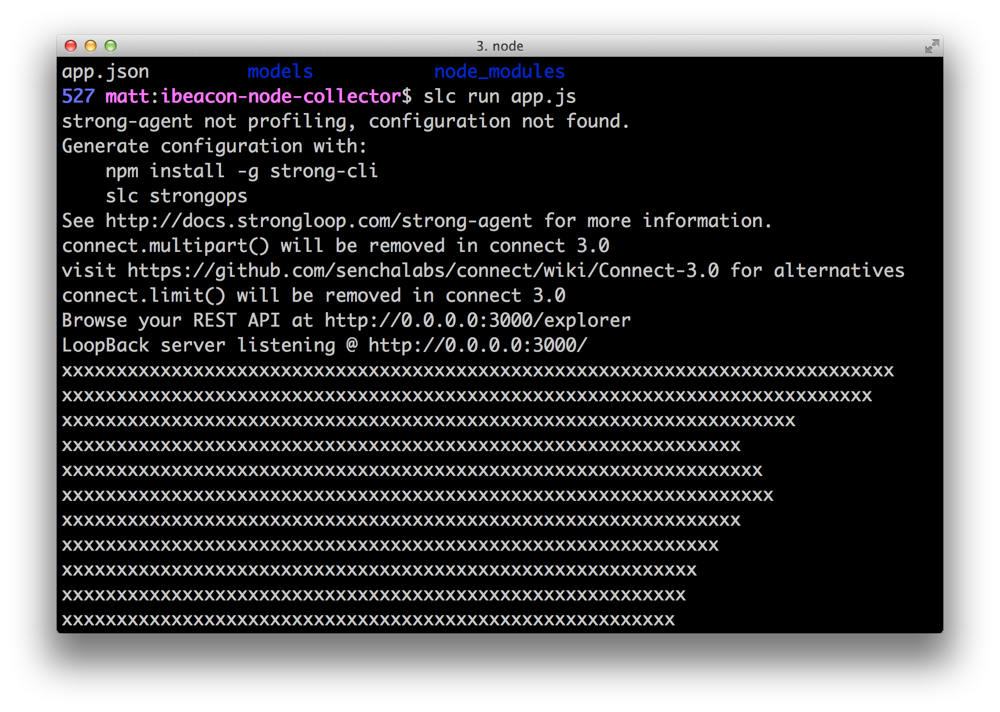
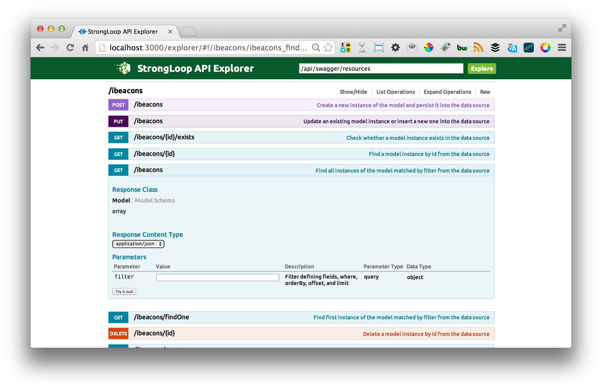
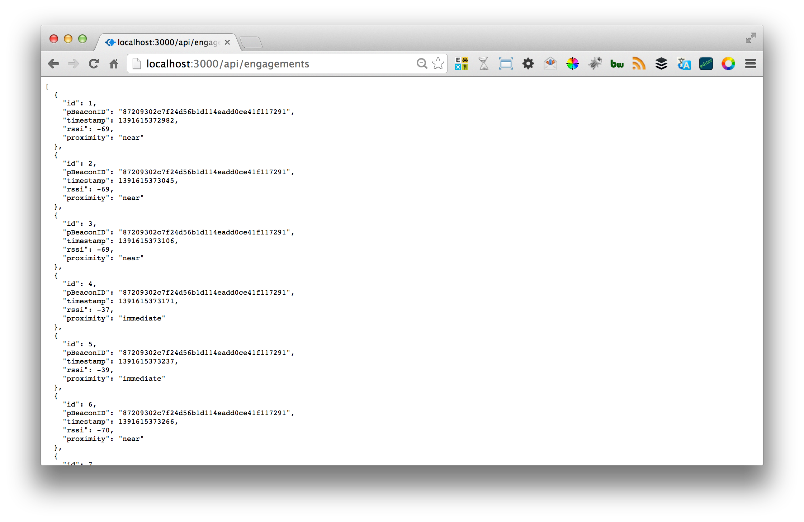

Tracking mobile iBeacons and BlueTooth Low Energy engagements with Node.js
--

###iBeacons and Bluetooth Low Energy (BLE)
Bluetooth Low Energy (BLE) ‘beacons’ have come into the world around us with Apple’s branded iBeacon witch gives branded convention and integration of the BLE devices.  iBeacon’s break down BLE into 3 core features: broadcast, monitoring and ranging.  

iBeacon is primarily a location service similar in many ways to mobile GPS Geolocation. Unlike GPS Geolocation, which gives mobile apps 'vicinity' awareness (limited to outdoor scenarios that have line of sight to GPS satellites), BLE iBeacon gives mobile application’s 'proximity' awareness.

###Bluetooth proliferation
The branding and assimilation of BLE into Apples iOS7 platform is causing a proliferation of Bluetooth ‘beacon-ing’ technology. Large implementations of the technology such as [ MLB's installation into ball parks ](http://techcrunch.com/2013/09/29/mlbs-ibeacon-experiment-may-signal-a-whole-new-ball-game-for-location-tracking/), and [PayPal's Beacon ](https://www.paypal.com/us/webapps/mpp/beacon ) payment system are making facilities and locations smart. Startups like [Estimote](http://), [Shelf Bucks](http://shelfbucks.com/), [Pebble](http://pebble.com) are making it easier for developers and businesses to integrate the technology into their customers’ daily lives and their mobile app’s.  The technology is poised to forever change kiosks, retail end-caps, payment terminals and the facilities around us. Historically these engagement touch points were blind, dumb and mute to your mobile device. Historically *the restrooms in the bathroom were the smartest machine in your average retail facility; at least the toilet knew to flush when a person stepped away*. iBeacons will make stores, and the devices inside them aware of the mobile devices (more importantly user) in the facility.  This gives analytics and insight into the previously dark world of “in store” behavior and engagement [changing everything in retail](http://www.forbes.com/sites/centurylink/2013/10/31/how-apples-ibeacon-will-change-everything-for-retail-analytics/) shopping experiences.

###You are your mobile ‘signature'
When you open a BLE enabled mobile app your Blue Tooth ‘signature' tracks your location and behavior by your proximity to other BLE aware machines and devices. In a similar way to how a web cookie allows retailers to track your journey through a web site, your real world engagements are tacked as you interact with BLE aware devices.

###The Power of Node.js
Using StrongLoops [LoopBack](http://strongloop.com/mobile-application-development/loopback/) and the open source [bleacon npm](https://npmjs.org/package/bleacon) package It’s very easy to track an iBeacon enabled mobile app using Node.js.  Will show you how to do this on your local machine and track the engagements from the machine interaction for later analysis and reporting.

###Tracking BLE engagements with 6 commands and 25 LOC 
You can build the demo on your own and see it run on a mac book pro (requires Mavericks) with Node.js by simply cloning the repo ‘git clone https://github.com/mschmulen/tracking-bluetooth-ibeacons-with-node’ and running it with ‘slc run app.js’
or build it from scratch by following the instructions below:

**Commands:**

```
npm install -g strong-cli
slc lb project ibeacon-node-collector
cd ibeacon-node-collector
npm install --save bleacon
slc lb model ibeacon
slc lb model engagement
```

The commands above installs the [strong-cli](http://https://npmjs.org/package/strong-cli)making giving us access to the ```slc lb``` commands to quickly scaffold an API tier and add our ```beacon``` and ```engagement``` data models. Installs the [bleacon](https://npmjs.org/package/bleacon) npm package and dependencies.

**Code:**

Add the 10 lines of code below to your app.'s file 
after line 121 in app.js file, right after ``` app.get('/', loopback.status()); ```  to [upsert](http://strongloop.com) a beacon engagement and beacon signature into the default in memory data store.

```
var ibeacon = app.models.ibeacon;
var Bleacon = require('bleacon');
var hist = [];

var ibeaconCache = new Array();

Bleacon.on('discover', function(bleacon) {
  
  guid = bleacon.uuid + bleacon.major + bleacon.minor;
  
  ibeacon.upsert({ guid:guid,uuid:bleacon.uuid, major:bleacon.major, minor:bleacon.minor},
    function( error, _ibeacon) {
    
			if ( error ) { console.log( "error on upsert " ); }
			else {
				var eng = app.models.engagement;
				eng.create({ pBeaconID: _ibeacon.guid, timestamp: Date.now(), rssi: bleacon.rssi, proximity: bleacon.proximity });
	} //end else success
 }); //end upsert
  
  hist.unshift(bleacon.rssi);
  if (hist.length > 50) hist.splice(50, 1);
  var avg = hist.reduce(function(total, current) { return total + current; }) / hist.length;
  var xs = new Array(Math.floor(-avg) + 1).join('x');
	//console.log( "discovered " + bleacon.uuid + " " + bleacon.major + ":" + bleacon.minor +" rssi:" + bleacon.rssi );
  console.log(xs);
	
});//end on discover

Bleacon.startScanning();
```

Test the implementation by installing an app that has iBeacon support. I'm using the [Estimote Virtual Beacon on the App Store](https://itunes.apple.com/us/app/estimote-virtual-beacon/id686915066?mt=8) for this demo.

Start the Estimote App in 'Beacons' mode.





Run the node application on your host machine with 

```slc run app.js```

In addition to entering the engagement in the in memory data store the code above will shows the BLE [ Received signal strength indication (RSSI) ](http://en.wikipedia.org/wiki/Received_signal_strength_indication) to the console log as your Node application receives Bleacon discover events.  The RSSI value is used to determine the proximity (distance) of a BLE peripheral.



###Run your node app anywhere and persist the data to MongoDB

You can install this on a Raspberry-Pi (just follow these instructions) to create a simple “sniffer” device that when plugged into the wall will track all the Bluetooth engagements that occur in your home, office or store.

If you want to persist your analytics data you can simply change the LoopBack model binding in ```datasources.json``` to point to a MongoDB instance, you can find more information on binding your Node.js API tier LoopBack supported data stores [here](http://strongloop.com).

It's also interesting to turn on StrongOps and watch the memory and CPU profile of your machine as your machine 'sniffer' captures.

Lets look at some of the beacon signatures and engagements that we have captured using the LoopBack Explorer feature.

[http://localhost:3000/explorer/](http://localhost:3000/explorer/)



###Search and filter API for engagement analysis
Using the LoopBack API you can get all the beacon signatures in the system from
[http://localhost:3000/api/engagements](http://localhost:3000/api/engagements)


Filter engagements based on a GUID:
[http://localhost:3000/api/engagements?filter[where][cBeaconGUID]=87209302c7f24d56b1d114eadd0ce41f15](http://localhost:3000/api/engagements?filter[where][cBeaconGUID]=87209302c7f24d56b1d114eadd0ce41f15)


Filter engagements based on GUID and time:
[http://localhost:3000/api/engagements?filter[where][cBeaconGUID]=87209302c7f24d56b1d114eadd0ce41f15&filter[where][pBeaconGUID]=87209302c7f24d56b1d114eadd0ce41f16](http://localhost:3000/api/engagements?filter[where][cBeaconGUID]=87209302c7f24d56b1d114eadd0ce41f15&filter[where][pBeaconGUID]=87209302c7f24d56b1d114eadd0ce41f16)

Filter engagements based on GUID interactions:
[http://localhost:3000/api/engagements?filter[where][cBeaconGUID]=87209302c7f24d56b1d114eadd0ce41f15&filter[where][pBeaconGUID]=87209302c7f24d56b1d114eadd0ce41f16](http://localhost:3000/api/engagements?filter[where][cBeaconGUID]=87209302c7f24d56b1d114eadd0ce41f15&filter[where][pBeaconGUID]=87209302c7f24d56b1d114eadd0ce41f16)


If you want to build your own iOS app you can start with this sample.

###Identify anonymous mobile beacon signatures and track people

Match the user to the anonymous signature and start tracking people within 100 feet of our machine.

If you want to go the extra mile, simply use the built in LoopBack ```user model``` object by adding an index reference to the ```beacon model```. When you convert all the anonymous beacon signatures to known users the engagements analytics show real world user behavior.

The conversion from an anonymous unknown user BLE iBeacon signature to known user behavior is the reason that retailers want you to open their customer loyalty app in the store and login.  Binding your user profiler to the device and allowing them to track your in store loitering and behavior (and possibly target engagements at you) in the same way they track your shopping behaviors online.

Whats Next ?
